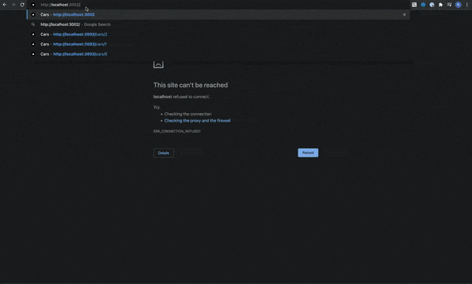

# <center>Poc: Using CSR, SSR, and SSG in NextJS</center>

<div align="center">
Demo application that compares three different rendering options for React apps.
</div>
<br/>
<div align="center">

</div>


## Getting Started

### Prerequisites:

* [Yarn](https://yarnpkg.com/)

### Installation

```shell
# csr demo app
(cd csr-supercars-gallery && yarn install)
# ssr demo app
(cd ssr-supercars-gallery && yarn install)
# ssg demo app
(cd ssg-supercars-gallery && yarn install)
```

### Usage

#### CSR - Client Side Rendering

1. First, run the development server:
    ```bash
    (cd csr-supercars-gallery && yarn dev)
    ```
2. Open [http://localhost:3000](http://localhost:3000) with your browser to see the result.
3. Open [http://localhost:3000/cars/2](http://localhost:3000/cars/2) to get supercar detail page.
4. Disable JavaScript in Chrome Browser (`Inspect -> Settings -> Debugger Disable JavaScript`).
5. Check page source (Right Click > View Page Source) and find `__next` div class
   ```html
   
   <div id="__next" data-reactroot="">
       <main class="Home_main__nLjiQ"><h1 class="Home_title__T09hD">Welcome to <a href="/">Supercars</a> Gallery!</h1><br>
           <div>
               <!-- 👇 unfortunately, no data rendered😔       -->
               <div class="container"></div>
           </div>
       </main>
       <footer class="Home_footer____T7K"><a href="https://github.com/rbiedrawa" target="_blank" rel="noopener noreferrer">Copyright
           © rbiedrawa</a></footer>
   </div>
   ```

#### SSR - Server Side Rendering

1. First, run the development server:
    ```bash
    (cd ssr-supercars-gallery && yarn dev)
    ```
2. Open [http://localhost:3001](http://localhost:3001) with your browser to see the result.
3. Open [http://localhost:3001/cars/2](http://localhost:3001/cars/2) to get supercar detail page.
4. Disable JavaScript in Chrome Browser (`Inspect -> Settings -> Debugger Disable JavaScript`).
5. Check page source (Right Click > View Page Source) and find `__next` div class
   ```html
   <div id="__next" data-reactroot="">
       <main class="Home_main__nLjiQ"><h1 class="Home_title__T09hD">Welcome to <a href="/">Supercars</a> Gallery!</h1><br>
           <div>
               <div class="container">
                  <!-- 👇 server side rendering works 😊!!!       -->
                   <div class="row"></div>
                   <div class="row"><h1 class="text-center">Chevrolet</h1></div>
               </div>
           </div>
       </main>
       <footer class="Home_footer____T7K"><a href="https://github.com/rbiedrawa" target="_blank" rel="noopener noreferrer">Copyright
           © rbiedrawa</a></footer>
   </div>
   ```

#### SSG - Static Site Generation

1. First, run the development server:
    ```bash
    (cd ssg-supercars-gallery && yarn dev)
    ```
2. Open [http://localhost:3002](http://localhost:3002) with your browser to see the result.
3. Open [http://localhost:3002/cars/2](http://localhost:3002/cars/2) to get car detail page.
4. Close the app.
5. Build the application
   ```bash
   (cd ssg-supercars-gallery && yarn build)
   ```
6. Notice that next.js generated couple of new sites under `/cars/[id]` path. Example output below:
   ```shell
   Page                                       Size     First Load JS
   ┌ ○ /                                      10.4 kB        93.8 kB
   ├   /_app                                  0 B            83.4 kB
   ├ ○ /404                                   194 B          83.6 kB
   ├ λ /api/cars                              0 B            83.4 kB
   ├ λ /api/search                            0 B            83.4 kB
   └ ● /cars/[id] (756 ms)                    1.15 kB        84.6 kB 
       ├ /cars/1  ## 👈 Our Server Side Generated pages😉
       ├ /cars/2 
       ├ /cars/3
       └ [+6 more paths]
   + First Load JS shared by all              83.4 kB
     ├ chunks/framework-5f4595e5518b5600.js   42 kB
     ├ chunks/main-a054bbf31fb90f6a.js        27.6 kB
     ├ chunks/pages/_app-8c800496702a7d2f.js  12.9 kB
     ├ chunks/webpack-9b312e20a4e32339.js     836 B
     └ css/8d73b106741109ce.css               24 kB
   
   λ  (Server)  server-side renders at runtime (uses getInitialProps or getServerSideProps)
   ○  (Static)  automatically rendered as static HTML (uses no initial props)
   ●  (SSG)     automatically generated as static HTML + JSON (uses getStaticProps)  ## 👈 Static site generation 💪
   ```
7. Open Bmw i8 static page.
   ```shell
   find ./ssg-supercars-gallery | grep -i pages/cars/9
   # Example output
   # ./ssg-supercars-gallery/.next/server/pages/cars/9.html
   # ./ssg-supercars-gallery/.next/server/pages/cars/9.json
   ```
8. Display content of `9.html` and `9.json` files.
   ```shell
   cat  ./ssg-supercars-gallery/.next/server/pages/cars/9.html
   cat ./ssg-supercars-gallery/.next/server/pages/cars/9.json 
   ```
9. View generated files.
   ```shell
   cat ./.next/server/pages/cars/9.html
   cat ./.next/server/pages/cars/9.json
   ```

## References

For further reference, please consider the following sections:

* [Nextjs](https://nextjs.org/docs/getting-started)
* [Nextjs - getServerSideProps](https://nextjs.org/docs/basic-features/data-fetching/get-server-side-props)
* [Nextjs - getStaticPaths](https://nextjs.org/docs/basic-features/data-fetching/get-static-paths)
* [Nextjs - getStaticProps](https://nextjs.org/docs/basic-features/data-fetching/get-static-props)
* [Visual Explanation and Comparison of CSR, SSR, SSG and ISR](https://dev.to/pahanperera/visual-explanation-and-comparison-of-csr-ssr-ssg-and-isr-34ea)

